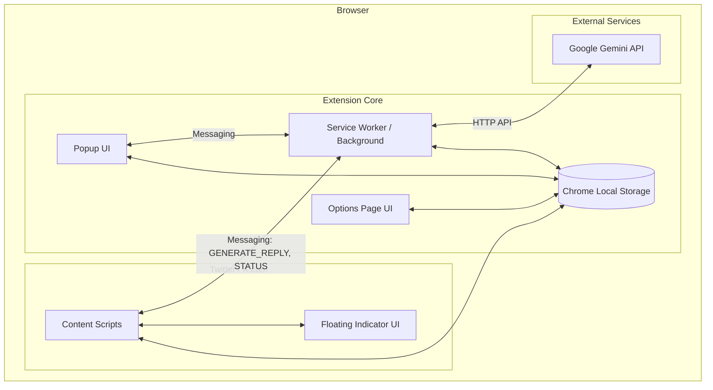
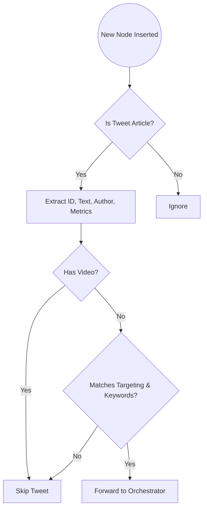
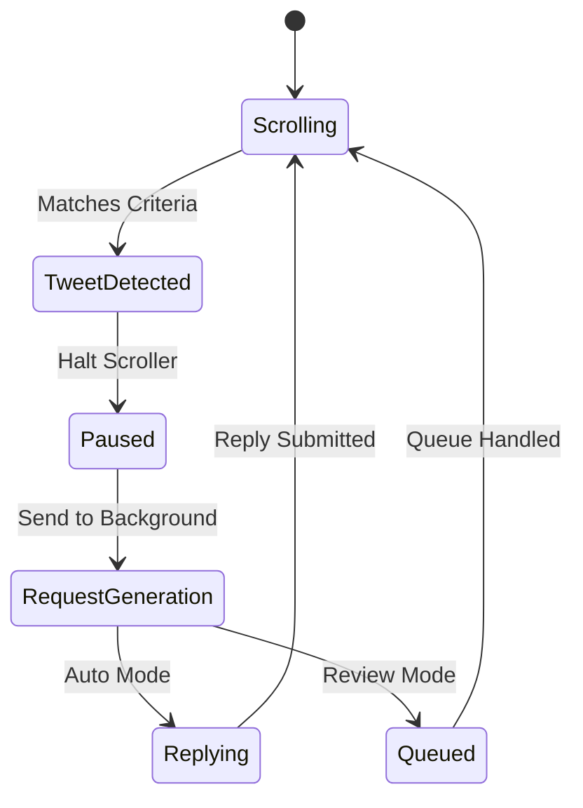

# XScroller - AI Twitter Engagement

XScroller is a powerful Chrome Extension (MV3) designed to automate Twitter/X feed scrolling and generate AI-powered replies based on a configurable persona, using the Google Gemini API.

To install dependencies:

```bash
bun install
```

To run:

```bash
bun run index.ts
```

This project was created using `bun init` in bun v1.2.0. [Bun](https://bun.sh) is a fast all-in-one JavaScript runtime.

---

## 🏛️ High-Level Design (HLD)

The extension is partitioned into the classic MV3 architecture, separating content interactions, background processing, and user interfaces.



### Components:
1. **Content Scripts (`content.js`, `scroller.js`, `detector.js`, `replier.js`)**: Runs directly on the X/Twitter webpage. Monitors the DOM, automates scrolling, extracts tweet data, and performs the physical typing and submission of replies.
2. **Service Worker (`service-worker.js`, `gemini.js`)**: Runs in the background. Manages state, limits, schedules alarms, queues replies for review mode, and handles HTTP communication with the Gemini API.
3. **Storage (`storage.js`)**: Centralized local data store for extension state, persona settings, targeting rules, safety constraints, and activity logs.
4. **User Interface (`popup.html`, `options.html`)**: Frontend for the user to configure the AI persona, adjust settings, and view interaction statistics.

---

## ⚙️ Low-Level Design (LLD) & Features

### 1. Tweet Detection & Extraction (`detector.js`)
Uses `MutationObserver` to watch the timeline for new `<article data-testid="tweet">` nodes. 
- **Extraction**: Parses text, author handle, tweet ID, and engagement metrics (likes, retweets, replies).
- **Targeting**: Evaluates the tweet against inclusion/exclusion keyword rules and minimum engagement thresholds.
- **Safety**: Skips tweets with videos or from blacklisted users.



### 2. Auto-Scroller (`scroller.js`)
Simulates human scrolling behavior.
- **Jitter**: Introduces a +/- 20% randomization to the pixel scroll amount per tick to evade basic bot detection.
- **Speed Modulation**: Configurable speed (1-10) mapping dynamically to base pixels per tick.
- **Pause/Resume**: Yields control when the extension needs to pause and reply to a tweet.

### 3. Orchestrator (`content.js`)
The brain of the content script side. Ties the sub-modules together.
- **Modes**: Supports `auto` (replies automatically), `review` (queues replies for human approval), and `scroll-only` (only scrolls and scans).
- **Pipeline**: Scroller → Detector → Orchestrator → Stop Scrolling → Open Reply Box → Request AI Reply (SW) → Replier → Resume Scrolling.
- **Floating UI**: Injects a non-intrusive status pill indicating current state (Scrolling, Paused, Replying, Off).



### 4. AI & Persona Logic (`background/service-worker.js`, `lib/persona.js`, `lib/gemini.js`)
Responsible for creating intelligent, contextual replies.
- **Persona Formulation**: Constructs a prompt based on the user's defined name, role, tone, expertise, and custom instructions.
- **Promotional Gating**: Probabilistically decides whether to append an promotional message (e.g., OpenLabs) to the generated reply based on user configuration (`promotionFrequency`).
- **Gemini Integration**: Sends structured prompts to the `@google/generative-ai` API and parses the response.

### 5. Synthetic Interaction & Replier (`replier.js`)
Bypasses React/Draft.js strictness by simulating human typing.
- **DOM Interaction**: Finds specific test-ids for reply buttons, text areas, and submit buttons.
- **Typing Simulation**: Uses `DataTransfer` to synthesize a true `paste` clipboard event to wake up X's input handlers, falling back to `document.execCommand` if necessary.
- **Delays**: Adds random delays (e.g., 500ms - 1500ms) between clicks, focus, typing, and submission to ensure reliability and mimicry.

### 6. Safety & Limits (State Management)
- **Daily Caps**: Enforces a strict `dailyLimit` on replies to prevent account suspension. State is tracked and reset via `chrome.alarms` based on the system date.
- **Duplicate Prevention**: Keeps a local set of processed Tweet IDs in memory and a historical log in storage to ensure a tweet is never replied to twice.
